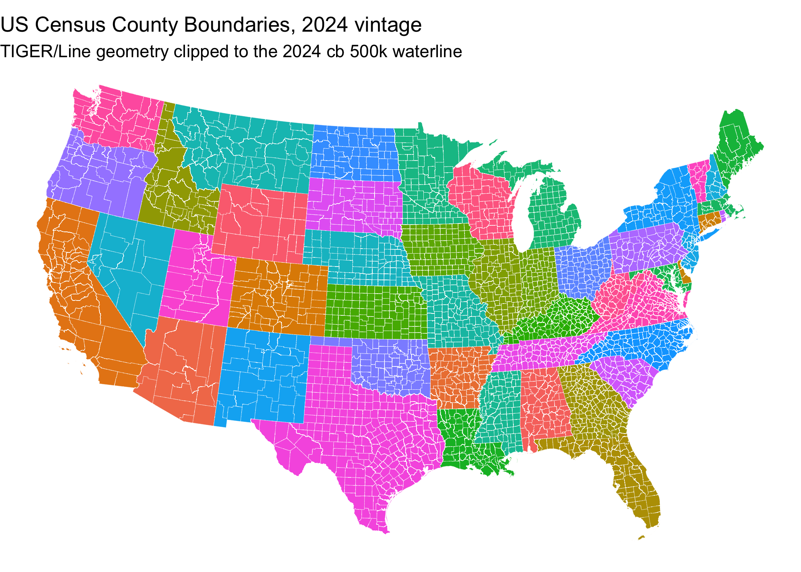

[](https://github.com/sustainable-fsa/census-counties)
[](https://zenodo.org/badge/latestdoi/1342365396)

This repository archives **vintage-matched US Census county boundaries**
— the boundaries against which the county-level determinations in the
[Sustainable FSA](https://sustainable-fsa.com) project were computed.
Each annual TIGER/Line vintage is archived as published, and again
clipped to the same year’s cartographic waterline for display.

## 📦 Dataset Overview

- **Title:** Vintage-Matched US Census County Boundaries
- **Source:** U.S. Census Bureau TIGER/Line and Cartographic Boundary
  files
- **Format:** GeoParquet (ZSTD-13), EPSG:4269 (NAD83)
- **Vintages:** 2000, 2009, 2010, and 2011–2025 (18 in all)
- **Extent:** 3,251 distinct counties and county equivalents, 58,182
  county-vintages
- **Distribution Type:** Public archival for research and historical
  purposes

## 📂 Contents

This repository is a
[BagIt](https://datatracker.ietf.org/doc/html/rfc8493) archive,
following the same layout as the
[`usdm`](https://github.com/sustainable-fsa/usdm) archive of record:

    census-counties/
    ├── bagit.txt, bag-info.txt, manifest-sha256.txt
    ├── census-counties.parquet                  every clipped vintage, stacked
    ├── census-counties-manifest.json            path, size and sha256 of each file
    └── data/
        ├── raw/tl_<year>_us_county.zip          Census downloads, verbatim
        ├── parquet/<year>-counties.parquet      raw TIGER/Line
        ├── clipped/<year>-counties.parquet      cut at that vintage's waterline
        └── quality/geometry_validation.csv      what enforcing validity changed

- [`data/parquet/<year>-counties.parquet`](https://data.sustainable-fsa.com/census-counties/)
  – raw TIGER/Line counties, exactly as Census published them. 18 files,
  about 46 MB each.
- [`data/clipped/<year>-counties.parquet`](https://data.sustainable-fsa.com/census-counties/)
  – the same geometries, cut at that vintage’s `cb` 500k waterline.
  About 46 MB each.
- [`census-counties.parquet`](https://data.sustainable-fsa.com/census-counties/census-counties.parquet)
  – all 18 clipped vintages in one file, 58,182 rows, sorted by `fips`
  then `year`. 107 MB.
- [`data/quality/geometry_validation.csv`](https://data.sustainable-fsa.com/census-counties/data/quality/geometry_validation.csv)
  – a per-county record of every geometry the build altered while
  enforcing validity.
- [`_manifest.txt`](https://data.sustainable-fsa.com/census-counties/_manifest.txt)
  – flat index of every file in the S3-hosted mirror.

`census-counties.parquet` is sorted by `fips` then `year` so a county’s
whole history is contiguous. Reading one vintage is better served by
that vintage’s own file in `data/clipped/`.

## 🧾 Field Descriptions

| Field Name | Description |
|----|----|
| `fips` | A five-digit FIPS state and county code (`census-counties.parquet` only) |
| `STATEFP` | A two-digit FIPS state code |
| `COUNTYFP` | A three-digit FIPS county code |
| `County` | The county name |
| `CountyLSAD` | The county name with its legal/statistical area description |
| `year` | The TIGER/Line vintage the geometry comes from |
| `mask_year` | The `cb` vintage whose waterline clipped **that county** (clipped and stacked forms only). Normally one value per vintage; 2009 and 2011 carry two |

## 🌊 Why Both Raw and Clipped

TIGER/Line (`tl_`) county boundaries are the legal ones, and they are
what the weekly USDM county aggregations in
[`usdm-counties`](https://github.com/sustainable-fsa/usdm-counties) are
computed against. So `tl` is the analytical truth, and this archive
keeps it unaltered.

But `tl` does not stop at water. Coastal counties and the Great Lakes
states extend far offshore — correct as a legal boundary, and misleading
as a picture. The clipped form exists so a map can show a county’s land
without implying that the lake belongs to it. It is **derived, never
authoritative**.

## 📅 The Clip Mask Matches the Vintage

Cutting 2012 land with a 2024 coastline produces a boundary belonging to
neither year. Each vintage is therefore clipped with the cartographic
boundary (`cb`) 500k file of the same year.

Census does not publish one for every vintage. Measured against
`www2.census.gov`:

| Vintage                | `cb` 500k county file                         |
|------------------------|-----------------------------------------------|
| 2010                   | `GENZ2010/gz_2010_us_050_00_500k.zip`         |
| 2013                   | `GENZ2013/cb_2013_us_county_500k.zip`         |
| 2014–2025              | `GENZ<year>/shp/cb_<year>_us_county_500k.zip` |
| 2000, 2009, 2011, 2012 | none published                                |

Those four vintages fall back to the nearest available year, recorded
per row in `mask_year`, so a reader can see which coastline was used
rather than reconstruct it.

A `cb` vintage also need not cover every state its `tl` counterpart
carries. `cb` 2010 is the only one without American Samoa, Guam, the
Northern Marianas and the US Virgin Islands, and `tl` 2009 and `tl` 2011
carry all four and both fall back to it. The mask is therefore composite
where it has to be: states the chosen `cb` misses are supplied from the
nearest `cb` that has them, and `mask_year` is recorded **per county**.
In `data/clipped/2009-counties.parquet` 3,221 rows carry `mask_year`
2010 and 13 carry 2013; every other vintage has a single value
throughout.

The mask only ever changes the coast. Inland boundaries keep full TIGER
detail — clipping an interior county to `cb` 5m and to `cb` 500k gives
byte-identical geometry, and landlocked counties come through at an area
ratio of exactly 1.0.

## 🔧 How It Is Built

[`census-counties.R`](census-counties.R) builds the whole archive:

1.  **Download** each TIGER/Line vintage. 2000, 2009 and 2010 come from
    decennial-specific paths; 2011 onward follow one URL pattern.
    Downloads resume.
2.  **Normalize** the schema — `COUNTYFP00`, `COUNTYFP10` and `COUNTYFP`
    all map to one set of columns — repair validity under both spherical
    and planar geometry, and recombine each county with an s2 coverage
    union.
3.  **Build the vintage’s mask** by unioning that year’s `cb` 500k
    counties in spherical geometry, dropping the artifact rings the
    union leaves behind, and supplying any missing state from the
    nearest `cb` that has it. The mask is checked for validity before
    anything is clipped with it.
4.  **Clip** in a single `mapshaper` invocation
    (`-clip … remove-slivers -clean rewind`), repair anything left
    invalid, and re-clip any residual county in spherical geometry,
    where an intersection of two valid geometries cannot be invalid.
5.  **Stack** every clipped vintage into `census-counties.parquet`.
6.  **Publish** to S3 and CloudFront through the shared
    [`R/s3-archive.R`](R/s3-archive.R) helpers.

## ✅ Geometry Validity

Every county in `data/clipped/` and in `census-counties.parquet` is
valid under both spherical (s2) and planar (GEOS) geometry, asserted at
build time rather than assumed. Counties in `data/parquet/` are s2-valid
by construction.

Enforcing validity means altering geometry, so the archive records what
it altered.
[`data/quality/geometry_validation.csv`](https://data.sustainable-fsa.com/census-counties/data/quality/geometry_validation.csv)
holds one row per county per build stage, written only where the
geometry moved or where it arrived or left invalid — a county passed
through untouched contributes no row, and its absence is the record. It
accumulates across runs.

| `stage` | What it records |
|----|----|
| `raw_repair` | What repair and the coverage union cost a county in `data/parquet/` |
| `mask_repair` | A `cb` county the mask build had to repair before unioning |
| `mask_fill_holes` | The mask itself: rings dropped, area returned, validity before and after |
| `clip` | A county the clip broke. Ordinary clipping is not logged; a row here means `mapshaper` returned something invalid |
| `clip_repair` | Which repair fixed it — `geos_make_valid`, `s2_rebuild`, `s2_union` — or `kept_as_is` |
| `clip_s2_fallback` | A county re-clipped in spherical geometry because nothing else made it valid |

| Column | Description |
|----|----|
| `year`, `fips` | The vintage, and the county — or `<mask>` for that vintage’s clip mask |
| `stage`, `method` | Which step of the build, and what it did |
| `s2_valid_before` / `_after`, `s2_reason_before` / `_after` | Spherical validity and failure reason on both sides |
| `geos_valid_before` / `_after`, `geos_reason_before` | Planar validity and reason. A ring one engine accepts the other can reject, so both are recorded |
| `area_m2_before` / `_after`, `area_delta_m2` | Spherical area in square metres, and what the operation cost |
| `area_ratio` | Planar area after ÷ before — the number the acceptance guard compares |
| `n_vertices_`, `n_parts_`, `n_rings_` `before` / `_after` | Shape accounting |
| `mask_year`, `build_date` | Which `cb` vintage supplied that county’s waterline, and when the row was written |

No repair is accepted on its word: a candidate is taken only if it is
valid **and** still holds at least 99.9% of the area it was handed.
`sf::st_make_valid()` has returned a county with its winding inverted
and a negative area, which every validity check in the stack calls fine
and which deletes the county the moment anything unions it.

## ☁️ Archive Hosting & Automated Publishing

The parquet artifacts are mirrored to S3 and served via CloudFront at
<https://data.sustainable-fsa.com/census-counties/> (browse the [archive
listing](https://data.sustainable-fsa.com/census-counties/) or
[`_manifest.txt`](https://data.sustainable-fsa.com/census-counties/_manifest.txt)
for a flat index). They are **not** committed to git: the archive is
about 3 GB, of which 1.3 GB is the verbatim Census downloads.

Publishing is handled by [`census-counties.R`](census-counties.R) via
the shared [`R/s3-archive.R`](R/s3-archive.R) helpers, and runs
automatically in GitHub Actions
([`.github/workflows/census-counties.yaml`](.github/workflows/census-counties.yaml))
whenever the script or workflow changes, or on manual dispatch. The
workflow authenticates to AWS via GitHub OIDC (no long-lived credentials
stored in the repo), re-renders this README, and commits it back to git
only if the rendered output changed.

## 🛠️ How to Use

``` sh
Rscript census-counties.R                               # all vintages, publish
VINTAGES=2020,2021 PUBLISH=0 Rscript census-counties.R  # two vintages, local only
```

Nothing is reprocessed unless necessary: membership in the S3 listing,
not a local file, decides whether a vintage already exists. A run that
finds nothing new costs one list call plus a HEAD request per candidate
vintage and publishes nothing. The weekly schedule exists because
TIGER’s release date moves — checking is nearly free, so a new vintage
is picked up the week it appears rather than whenever someone remembers
to look. A vintage from 2014 on is built only once its own cb 500k file
exists too; Census posts cb a few months after TIGER/Line, and clipping
with a neighbouring year’s coastline would be archived permanently.

## 📍 Quick Start

Load a clipped vintage straight from the archive and map it, shading
each state so county structure is visible.

``` r
library(sf)
library(ggplot2)
library(dplyr)

counties <-
  sf::read_sf("https://data.sustainable-fsa.com/census-counties/data/clipped/2024-counties.parquet") |>
  dplyr::filter(!STATEFP %in% c("02", "15", "60", "66", "69", "72", "78")) |>
  sf::st_transform("EPSG:5070")

ggplot(counties) +
  geom_sf(aes(fill = STATEFP), color = "white", linewidth = 0.05,
          show.legend = FALSE) +
  labs(title = "US Census County Boundaries, 2024 vintage",
       subtitle = "TIGER/Line geometry clipped to the 2024 cb 500k waterline") +
  theme_void()
```



## 📌 Background

Census county boundaries are revised every year. Most revisions are
re-digitization rather than real change — between 2012 and 2013, over
99% of vertices are identical — but a handful are substantive:
Broomfield County, Colorado (2001), the dissolution of Bedford City,
Virginia (2013), Alaska borough reorganizations, and Connecticut’s
replacement of counties with planning regions (2022).

Because eligibility determinations are made against the boundaries in
force at the time, an archive that keeps every vintage is the only way
to reproduce a historical determination — or to show a reader the county
as it was when the decision was made.

## 📝 Citation

If you use this data in published work, please cite:

> U.S. Census Bureau. *TIGER/Line and Cartographic Boundary Files*.
> Curated and archived as vintage-matched county boundaries by R. Kyle
> Bocinsky, Montana Climate Office, University of Montana. Sustainable
> FSA project. Accessed YYYY-MM-DD.
> <https://sustainable-fsa.com/census-counties/>
>
> DOI: <https://doi.org/10.5281/zenodo.22059330>

Machine-readable metadata are in [`CITATION.cff`](CITATION.cff);
GitHub’s **Cite this repository** button (top right of the repo page)
renders it as APA or BibTeX.

Source data are US Census Bureau products and are in the public domain.

**Acknowledgment**: This work is part of the [*Enhancing Sustainable
Disaster Relief in FSA
Programs*](https://www.ars.usda.gov/research/project/?accnNo=444612)
project, supported by the USDA Office of the Chief Economist, Office of
Energy and Environmental Policy, and the USDA Climate Hubs.
